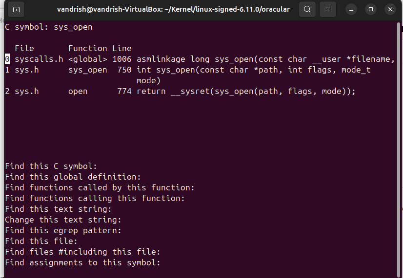
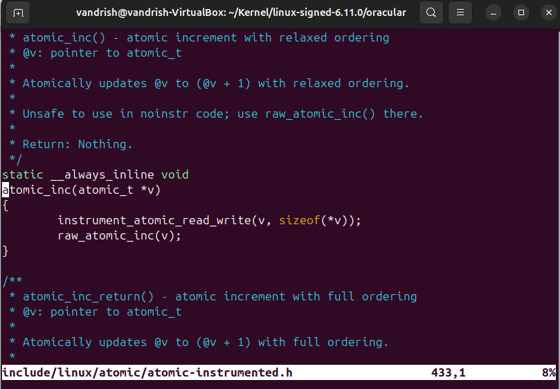
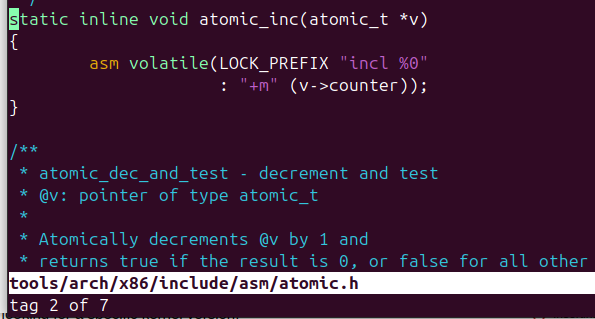
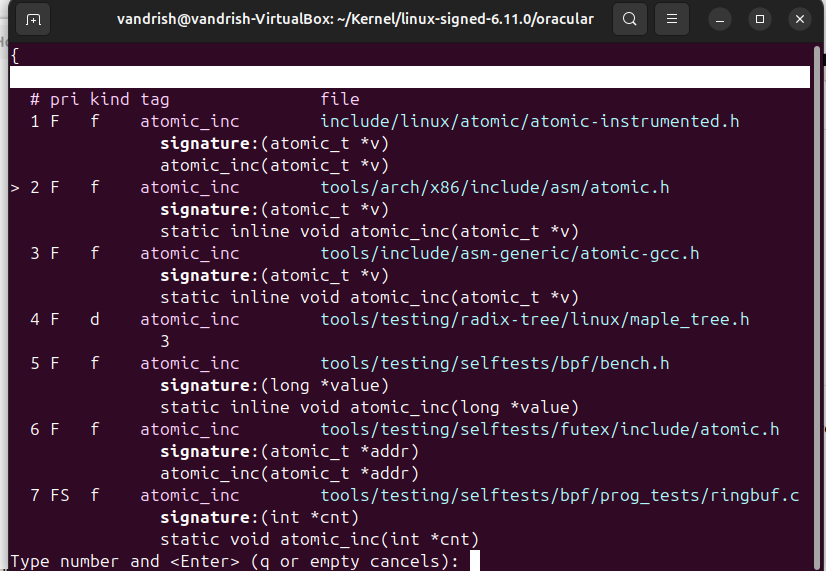
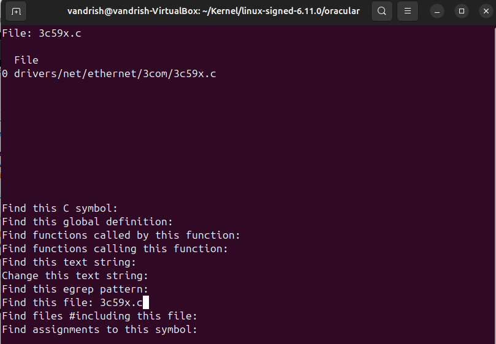

Fetch the Ubuntu kernel source.
1. Fetch the kernel source code.
2. For your kernel, do make cscope and make tags.

  I just download it via 'apt install'

  $ sudo apt install exuberant-ctags
  $ sudo apt install cscope

3. Test the ctags facility of the vi text editor.
   
a. Look up the function in the Linux kernel called sys_open().

If you find macro definitions at first, do :tn to find the
next definition, and until you find the function definition.

b.The sys_open() function makes use of other functions. Move your cursor to one of these functions and hit Ctrl-].
What happened?

**Go to the insertion**

c. Hit the key sequence Ctrl-T. What happened?

**Back to the preious insertion**

d. Use the :tag command to look up the tag atomic_inc. Use the :tn command. What did this do? What does the :ts
command do?

**also for :tag atomic_inc in vim**

e. Without changing directories, load the file 3c59x.c.

**:tags 3c59x.c in vim or file find in cscope**

f. Use the command :tags. What does this show?

**All tags related to the given info**
